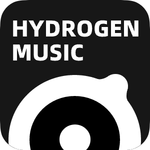

<br />
<p align="center">
  <a href="https://github.com/xudong16/Hydrogen-Music" target="blank">
    
  </a>
  <h2 align="center" style="font-weight: 600">Hydrogen Music</h2>

## ⚠️ 注意：
- 本项目原作者为 [Kaidesuyo](https://github.com/Kaidesuyo)，本仓库为社区维护版本。
- 由于本地管理功能并不完善，请尽量将其作为流媒体播放器使用。
- 因网易增加了网易云盾验证，密码与邮箱登录无法使用，请使用二维码登录。
- 请尽量不要使用云盘中的上传功能，目前上传失败概率大且内存无法得到释放。
- <a href="#%EF%B8%8F-安装" target="blank"><strong>📦️ 下载安装包</strong></a>

## 📦️ 安装

访问 [Releases](https://github.com/xudong16/Hydrogen-Music/releases)
页面下载安装包。

## 👷‍♂️ 打包客户端

由于个人设备限制，只打包了Windows平台的安装包且并未适配macOs与Linux平台。
如有可能，您可以在开发环境中自行适配。

```shell
# 打包
npm run dist
```

## :computer: 配置开发环境

运行本项目

```shell
# 安装依赖
npm install

# 运行Vue服务
npm run dev

# 运行Electron客户端
npm start
```

## 📜 开源许可

本项目仅供个人学习研究使用，禁止用于商业及非法用途。

基于 [MIT license](https://opensource.org/licenses/MIT) 许可进行开源。

## 灵感来源

网易云音乐API：[Binaryify/NeteaseCloudMusicApi](https://github.com/Binaryify/NeteaseCloudMusicApi)<br />
哔哩哔哩API：[SocialSisterYi/bilibili-API-collect](https://github.com/SocialSisterYi/bilibili-API-collect)

- [qier222/YesPlayMusic](https://github.com/qier222/YesPlayMusic)
- [Apple Music](https://music.apple.com)
- [网易云音乐](https://music.163.com)

## 🖼️ 截图

![home][home-screenshot]
![playlist][playlist-screenshot]
![lyric][lyric-screenshot]
![music_video][music_video-screenshot]

[lyric2-screenshot]: img/lyric2.png
[home-screenshot]: img/home.png
[playlist-screenshot]: img/playlist.png
[lyric1-screenshot]: img/lyric1.png
[music_video-screenshot]: img/music_video.png
